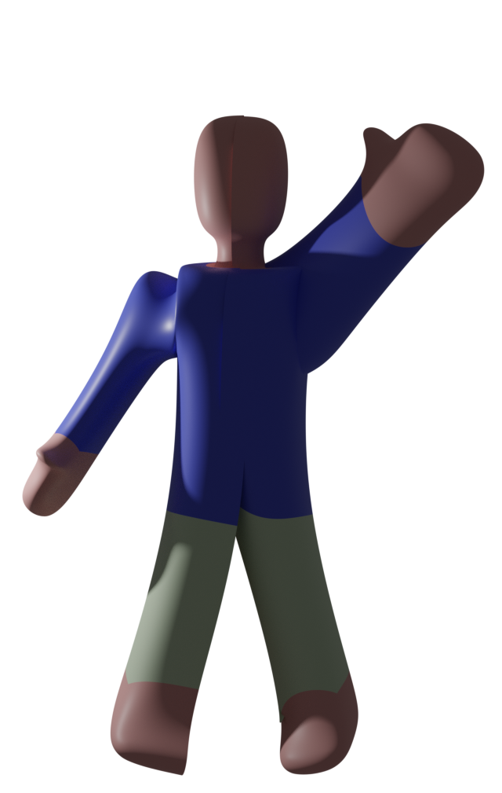

<div align="center">

```
███████╗ ██████╗██╗  ██╗████████╗      ███╗   ███╗███╗   ██╗████████╗
██╔════╝██╔════╝╚██╗██╔╝╚══██╔══╝      ████╗ ████║████╗  ██║╚══██╔══╝
███████╗██║      ╚███╔╝    ██║   █████╗██╔████╔██║██╔██╗ ██║   ██║   
╚════██║██║      ██╔██╗    ██║   ╚════╝██║╚██╔╝██║██║╚██╗██║   ██║   
███████║╚██████╗██╔╝ ██╗   ██║         ██║ ╚═╝ ██║██║ ╚████║   ██║   
╚══════╝ ╚═════╝╚═╝  ╚═╝   ╚═╝         ╚═╝     ╚═╝╚═╝  ╚═══╝   ╚═╝   
```

[](https://git.io/typing-svg)


</div>

---



### 👾 `whoami`

```yaml
name:     Scxt-mnt
role:     Fullstack Web Dev  /  Game Dev
focus:    Web Apps · Game Engines · Low-level Graphics
tools:    VS Code, Blender, Figma
vibe:     "Lose track of time while coding — often"
status:   Always building something 🔨
```

<br clear="right"/>

---

### 🧰 Tech Arsenal

#### 🌐 Web


#### 🎮 Game Dev & Graphics


#### 🎨 Design & Assets


---

### 📊 Stats

<div align="center">


</div>

<div align="center">

[](https://git.io/streak-stats)

</div>

---

### 🔬 What I Explore

```
🌐  PERN Stack Web Apps     ──────────────────────────  Production
🎮  Game Dev (LibGDX/LWJGL) ───────────────────────     In Progress
⚙️  Custom Game Engines     ────────────────────        For fun
🔷  OpenGL / GLSL Shaders   ────────────────────        Because why not
🧊  3D Modeling (Blender)   ──────────────────          Asset pipeline
🎨  UI/UX Prototyping       ────────────────────        Figma & beyond
```

---

### 🔗 Find Me

<div align="center">

[](https://github.com/Scxt-mnt)
[](https://www.linkedin.com/feed/)
[](https://www.instagram.com/)

</div>

---

<div align="center">
  
</div>

